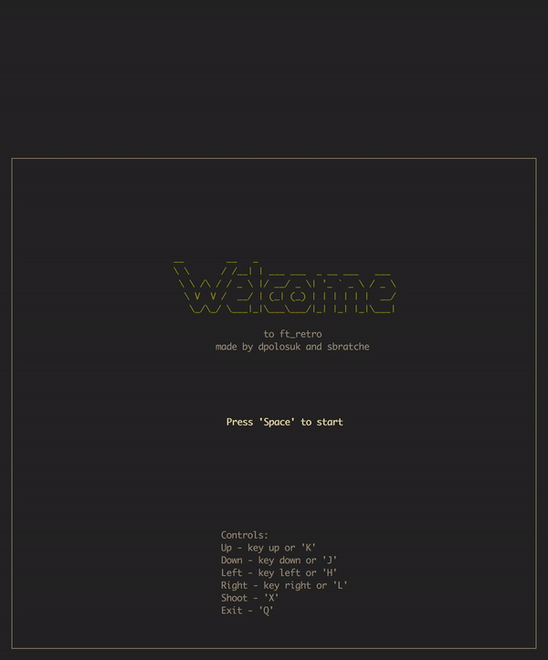

# ft\_retro

This is a quick project from CPP pool in school 42.

The goal of this project was to create a game in terminal using ncurses library in two days.

Teams are chosen randomly.

----------



## Want to try it out?

```{bash}
$ git clone https://github.com/Dornat/ft_retro.git
$ cd ft_retro
$ make
$ ./ft_retro
```

## Subject

Features																		|Completion
--------------------------------------------------------------------------------|--------------
Timer																			|Done
Health																			|Done
Score																			|Done
Moving stars in background														|Done
Enemies can shoot																|Done
Player takes hit from enemies and when the enemy passes bottom of the screen	|Done
HealthKit to restore some health												|Done
The Game is over when colliding with an enemy 									|Done
